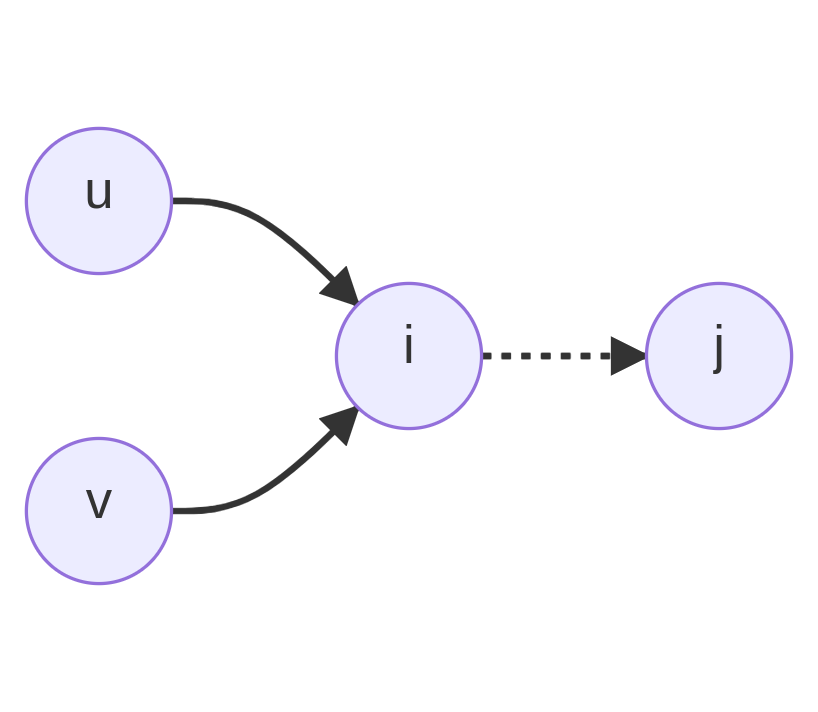

Belief Propagation
===

There are three main graph models that belief propagation looks to be run on:

* Bayesian Network
* Factor Graph
* Markov Random Fields (MRF)

### Markov Random Field

Finite Markov Random Fields (MRF) will be considered.

$$ G(V,E), \ \ \  |V| = n, \ \ \ x_i \in D = \{ d_0, d_1, \cdots, d_{m-1} \}  $$

$$
i \in V \to g_i(\cdot) \in \mathbb{R}
$$

$$
(i,j) \in E \to f_{i,j}( \cdot, \cdot ) \in \mathbb{R}
$$

* $x_i$ represents the value of vertex $i$.
* $g_i(x_i)$ is the mapping of vertex $i$ with value $x_i$
* $f_{i,j}(x_i,x_j)$ is the mapping of the connected vertex $i$ and $j$
  with values $x_i$ and $x_j$, respectively

For example, $f_{i,j}(x_i,x_j)$ could be an indicator function that
vertex $i$ and $j$ could have values $x_i$ and $x_j$.

### Belief Propagation on a (discrete) Markov Random Field

```
::mermaid
graph LR
  u((u)) & v((v)) --> i((i)) -.-> j((j)))
```

| |
|---|
|  |

Each vertex, $i$, can be associated with a random variable, $X_i$, taking
on (discrete) values chosen from some domain $D = \{ d_0, d_1, \cdots, d_{m-1} \}$ with
a probability distribution function $g_i(\cdot)$.

$$
\mu_{i,j}^{t+1}(b) = \sum_{a \in D} f_{i,j}(a,b) \cdot g_i(a) \cdot \prod_{k \in N(i) \text{ \\\\ } j} \mu_{k,i}^{t}(a)
$$

$$
P(X_i = a) \approx b^t_i(a) \propto g_i(a) \cdot \prod_{k \in N(i)} \mu^t_{k,i}(a)
$$

$$
\sum_{b \in D} \mu_{i,j}^{t}(b) = 1,  \ \ \ \ \sum_{a \in D} b^t_i(a) = 1
$$

The product can be more compactly represented by a function $h^t_{i,j}(\cdot)$:

$$
h^t_{i,j}(a) = g_i(a) \cdot \prod_{k \in N(i) \text{\\\\} j } \mu^t_{k,i}(a)
$$

$$
\mu_{i,j}^{t+1}(b) = \sum_{a \in D} f_{i,j}(a,b) \cdot h^t_{i,j}(a)
$$

One can recast this as a matrix multiplication:

$$ \begin{bmatrix} f_{i,j}(d_0,d_0) & f_{i,j}(d_1,d_0) &  \cdots & f_{i,j}(d_{m-1},d_0) \\\\ f_{i,j}(d_0,d_1) & f_{i,j}(d_1,d_1) &  \cdots & f_{i,j}(d_{m-1},d_1) \\\\ \vdots  & \vdots & \ddots & \vdots & \\\\ f_{i,j}(d_0,d_{m-1}) & f_{i,j}(d_1,d_{m-1}) &  \cdots & f_{i,j}(d_{m-1},d_{m-1}) \end{bmatrix} \begin{bmatrix} h_{i,j}^{t}(d_0) \\\\ h_{i,j}^{t}(d_1) \\\\ \vdots \\\\ h_{i,j}^{t}(d_{m-1}) \end{bmatrix} = \begin{bmatrix} \mu_{i,j}^{t+1}(d_0) \\\\ \mu_{i,j}^{t+1}(d_1) \\\\ \vdots \\\\ \mu_{i,j}^{t+1}(d_{m-1}) \end{bmatrix}
$$


Since $h^t_{i,j}(\cdot)$ has no dependence on $b$, this speeds up a naive calculation re-using results.

If the $f_{i,j}(\cdot,\cdot)$ function has low rank it can be factored into a singular value decomposition (SVD) for further savings:

$$ U \cdot S \cdot V = \begin{bmatrix} \vec{u_0}^\dagger & \vec{u_1}^\dagger & \cdots & \vec{u_{r-1}}^\dagger \end{bmatrix} \begin{bmatrix} s_0 & 0 &  \cdots & 0 \\\\ 0 & s_1 & \cdots & 0 \\\\ \vdots & \vdots  & \ddots \\\\ 0 & 0 &  \cdots & s_{r-1} \end{bmatrix} \begin{bmatrix} \vec{v_0} \\\\ \vec{v_1} \\\\ \vdots \\ \vec{v_{r-1}} \end{bmatrix}
$$


---

#### Sum-Product Belief Propagation

$$
G(V,E)
$$

$$
s, t \in V, x_{*} \in S = \{ s_0, s_1, \cdots, s_{n-1} \}
$$

$$
\mu_{s \to t}(x_t) = \sum_{x_s} [ \phi_{s t}(x_s,x_t) \prod_{u \in N(s) / t} \mu_{u \to s} (x_s) ] 
$$
$$
b_t(x_t)  \propto \prod_{s \in N(t)} \mu_{t \to s}(x_s)
$$

* $s,t$ - verticies in the graph ($s,t \in V$)
* $x_s, x_t \in S$ - values at the vertices (one of a discrete set of values from $S = \{ s_0, s_1, \cdots, s_{n-1} \}$)
* $N(s)$ - neighbors of vertex $s$
* $N(s) / t$ - neighbors of vertex $s$ excluding vertex $t$
* $\phi_{s t}(x_s,x_t)$ - probability/weight of finding value $x_s$ at position $s$ next to value $x_t$ at position $t$
* $\mu_{s \to t}(x_t)$ - probability/message from position vertex $s$ that value $x_t$ at vertex $t$ is allowed
* $b_t(x_t)$ - "belief" of value $x_t$ at position $t$ ("belief" that vertex $t$ holds value $x_t$)

```
A - B - C
    |   |
    D - E
```


###### 2022-08-16
