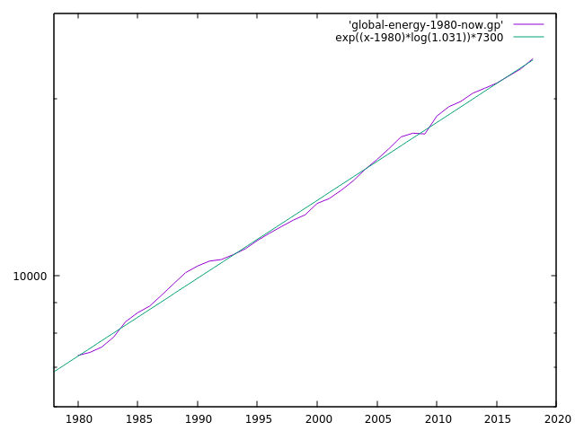
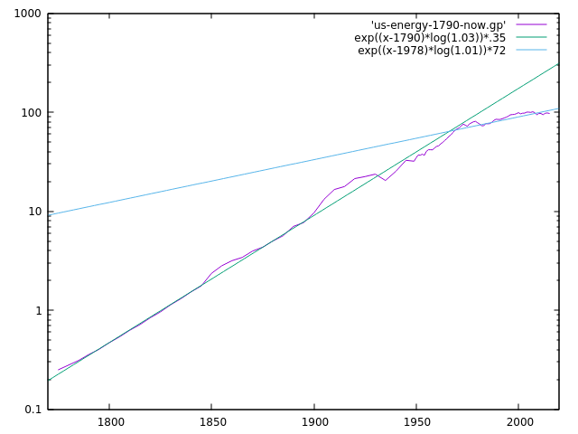

Solar Energy Discussion
===

Energy Limits of Earth
---

All estimates are going to be conservative.

$$
\begin{array}{ll}
\textbf{Earth Radius} & \approx 6.371 \cdot 10^6 (m) \\\\
\textbf{Solar Energy} & \approx 240 \frac{W}{m^2} \\\\
\textbf{Earth Population} & \approx 7.7 \cdot 10^9 \\\\
\textbf{Average Energy Per Person} & \approx 30 kWh \text{ daily usage}
\end{array}
$$

Approximate the solar energy available on land by underestimating the area
by taking the disk as described by the radius of the Earth:

$$
\begin{array}{l}
\pi \cdot (6.371 \cdot 10^6)^2 (m^2) \cdot (240 \frac{W}{m^2}) \cdot (24 \frac{h}{day}) \\\\
\to ~ 700 \cdot 10^{15} \frac{W h}{day}
\end{array}
$$

Estimating global population usage:

$$
\begin{array}{l}
(7.7 \cdot 10^9) \cdot (30 \cdot 10^3 \frac{W h}{day}) \\\\
\to ~ 0.231 \cdot 10^{15} \frac{W h}{day}
\end{array}
$$

So, as a rough upper bound, the energy requirement of
humans that could be "theoretically" satisfied by the sun's energy
is about an increase of
$ \frac{700}{.231} (\approx 3030) $ more people,
or about a population of 23 trillion people.

World Adoption of Solar
---

At a current growth rate of $29\%$ with $2.1\%$ of the population being
supplied by solar, an estimate for the full adoption would be:

$$
\begin{array}{l}
2.1 \cdot (1.29)^y = 100 \\\\
\to y = \frac{ \ln(\frac{100}{2.1}) }{ \ln(1.29) } \\\\
\to y \approx  15.17
\end{array}
$$

Or about 15 years till we see a large scale rollout and adoption.

Some caveats are that this assumes exponential growth for the entirety of
the adoption where the more likely event is some "s-curve" or other logistic
curve as it nears full adoption.

It further assumes constant $29\%$ growth.
Also note that the vast majority of this growth is from China production.

World Energy Consumption
---

One estimate for the energy consumption used by the world is about a $3\%$ annual increase, globally.

Here a plot of energy usage globally, taken from the [EIA](https://www.eia.gov/international/data/world/total-energy/total-energy-consumption?pd=44&p=0000000010000000000000000000000000000000000000000000000000u06&u=0&f=A&v=mapbubble&a=-&i=none&vo=value&&t=C&g=00000000000000000000000000000000000000000000000001&l=249-ruvvvvvfvtvnvv1vrvvvvfvvvvvvfvvvou20evvvvvvvvvvnvvvs0008&s=315532800000&e=1514764800000).

| |
|---|
|   |

Here is the energy usage for the USA:

| |
|---|
|  |

Some caveats:

* The units are different in the two different graphs because of differing sources for the data
* China makes up for most of the energy usage, as do other developing nations, whereas the USA and Europe have slowed to less than $2\%$ energy usage
* The USA had some sort of change in the late 1970s and went from $3\%+$ energy usage to around $1\%$ energy usage

If a conservative $3\%$ annual increase is taken, the numbers above for the suns available energy on the earth and the
current energy consumption of the worlds population, we can get an estimate for when the energy consumption will exceed
the earths available energy from the sun:

$$
\begin{array}{l}
\frac{700 \cdot 10^15 \cdot \frac{W h}{day} }{ .231 \cdot 10^{15} \frac{W h}{day} } \\\\
\approx 3030
\end{array}
$$

$$
\begin{array}{l}
\exp( y \cdot \ln(1.03) ) = 3030 \\\\
\to y = \frac{ \ln(3030) }{ \ln(1.03) } \\\\
\to y \approx 271 \text{ years }
\end{array}
$$

Which gives us a rough estimate of 270 years for us to reach a "Type I" civilization on the Kardeshev scale.

References
---

* [Earth Radius](https://imagine.gsfc.nasa.gov/features/cosmic/earth_info.html)
* [Solar Energy Potential](https://en.wikipedia.org/wiki/Solar_energy#Potential)
* [Global Population](https://en.wikipedia.org/wiki/World_population#Annual_population_growth)
* [Growth of Photovoltaics](https://en.wikipedia.org/wiki/Growth_of_photovoltaics#Current_status) ([source](https://iea-pvps.org/wp-content/uploads/2020/01/IEA-PVPS_-_A_Snapshot_of_Global_PV_-_1992-2017.pdf))
* [World Energy Usage](https://www.eia.gov/international/data/world/total-energy/total-energy-consumption?pd=44&p=0000000010000000000000000000000000000000000000000000000000u06&u=0&f=A&v=mapbubble&a=-&i=none&vo=value&&t=C&g=00000000000000000000000000000000000000000000000001&l=249-ruvvvvvfvtvnvv1vrvvvvfvvvvvvfvvvou20evvvvvvvvvvnvvvs0008&s=315532800000&e=1514764800000)
* [Country Energy Usage](https://github.com/InsideEnergy/U.S.-Energy-History-Data/blob/master/us-energy-use-1790-2015.csv)
* [Kardashev scale](https://en.wikipedia.org/wiki/Kardashev_scale)

###### 2021-04-24
