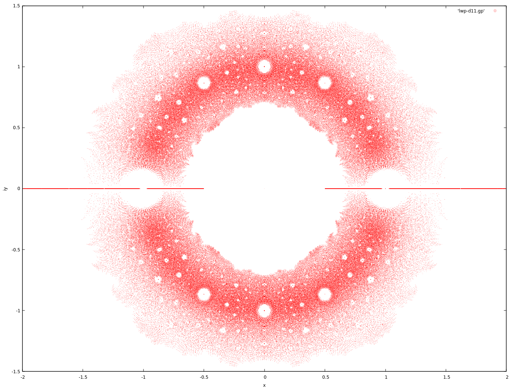
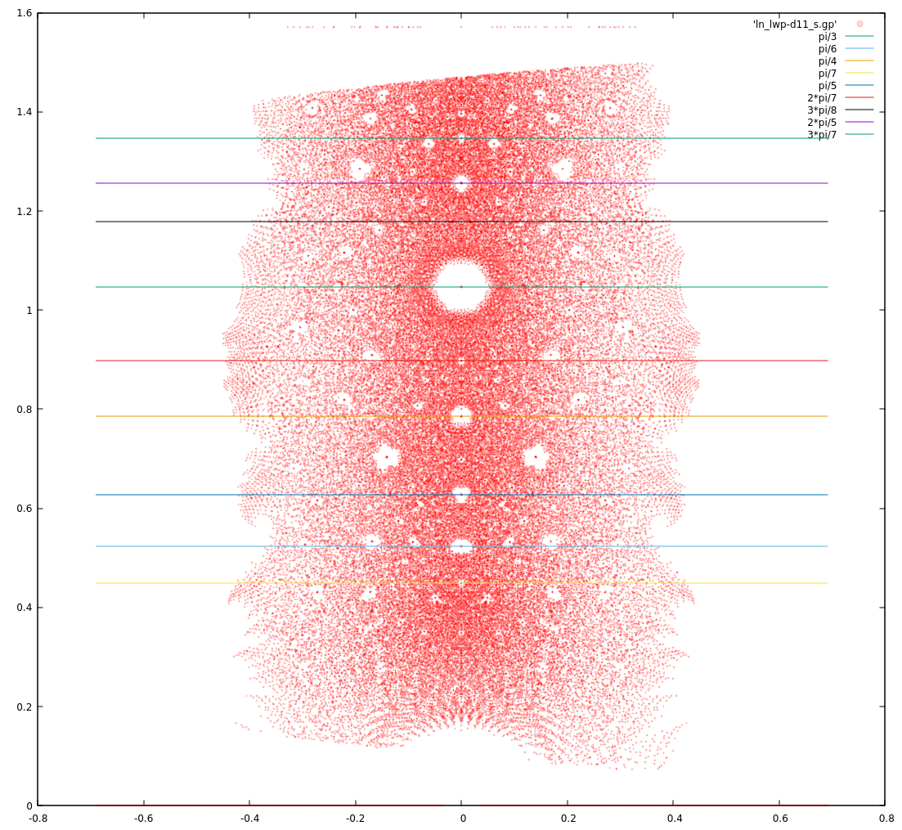

Littlewood Polynomial Notes
===

Littlewood polynomials are polynomials whose coeffients are drawn from
a finite set of $\{-1,1\}$.

Plotting the roots of augmented Littlewood polynomials (allowing for 0 as a coefficient)
for a restricted degree $n$ yields pretty pictures.

---

**Claim**:

$$
\begin{align}
& c_k \in \{-1, 0, 1\} \\\\
p(z) & = \sum c_k z^k  \\\\
p(z_0) & = 0 & \\\\
\to |z_{0}| & \ge \frac{1}{2} \text{ or } z_{0} = 0 \\\\
\end{align}
$$

Proof (by contradiction):

$$
\begin{align}
& c_0 \ne 0  \\\\
 \to p(z_0) & = c_0 + \sum_{k=1}^{n} c_k z_{0}^k \\\\
 \to 1 & = | \sum_{k=1}^{n} c_k z_{0}^k | \\\\
 \to 1 & < \sum_{k=1}^{n} | \frac{1}{2} |^k < 1 \\\\
\end{align}
$$

[source](https://golem.ph.utexas.edu/category/2009/12/this_weeks_finds_in_mathematic_46.html#c030053)

This is sloppy and doesn't take into account degree, $n$, of the polynomial.

"In the limit", this is true, but this is violated for smaller degree polynomials.

---

In general, we can ask what are the symmetries of transformations on $z$ that will
still admit Littlewood polynomials.

Some candidates for $p(z)$ are:

* $p(z^{-1})$
* $p(z^{\dagger})$
* $p(-z)$

The complex conjugate gives the mirror symmetry about the x-axis.
The negation and complex conjugation gives the symmetry about the y-axis ($p(\alpha + i \beta) = 0 \to q(-\alpha + i \beta)=0$).
The inversion gives a kind of projection onto the Riemann sphere and/or Mobius transformation like
symmetry, giving a projection symmetry about the circle/sphere at radius 1.

---

$$
\begin{align}
& c_k \in \{-1, 0, 1\} \\\\
p(z) & = \sum c_k z^k \\\\
\end{align}
$$

y-axis symmetry ($x \to -x$):

$$
\begin{align}
p_{-}(z) & = \sum_{k=0}^n (-1)^k c_{k} z^k \\\\
p(z) & = p_{-}(-z) \\\\
\to p(z_0) & = p_{-}(-z_0) = 0
\end{align}
$$

x-axis symmetry ($x \to x^{ \dagger }$):

$$
\begin{align}
p_{\dagger}(z) & = \sum_{k=0}^n c_{k} ( z^{ \dagger })^k \\\\
p(z) & = p_{ \dagger }( z^{ \dagger } ) \\\\
\to p(z_0) & = p_{ \dagger }( z_0^{ \dagger } ) = 0 \\\\
\end{align}
$$

Since the coefficients are real, $p_{\dagger}(z)$ has the same roots.

Inversion symmetry ($x \to \frac{1}{x}$):

$$
\begin{align}
p_{-1}(z) & = \sum_{k=0}^n c_{n-k} z^k \\\\
p(z) & = z^n p_{-1}(z^{-1}) \\\\
\to p(z_{\dagger}) & = z_{\dagger}^n p_{-1}(z_{\dagger}^{-1}) = 0 \\\\
\end{align}
$$

Noting that $z^n p_{-1}(\frac{1}{z})$ is also a Littlewood polynomial.

All of the above create a situation that for every $p(z)=0$, there's a corresponding
$p_{-}(-z)=0$, $p_{\dagger}(z^{\dagger})=0$ and $p_{-1}(z^{-1})=0, (z \ne 0)$, establishing
the gross level symmetry.

---

An explanation of how Dragon curves show up:

The idea is that the dragon curve can be created through in iterated
function system (IFS) by choosing randomly between $f_{-,z}(x)=1-zx$ and $f_{+,z}(x)=1+zx$
for some complex z and initial $x=0$.

The iteration of $\{f_{-,z}, f_{+,z}\}$ trace out all Littlewood polynomials for
initial values of $f_{-,z}(0)$ and $f_{+,z}(0)$.

Here's what I think the argument is in the category cafe thread:

$p(z_0)=0$ is the result of a finite cutoff IFS from above.
If the IFS is a nice fractal, that means other polynomials from the IFS evaluated
at the source point $z_0$ will trace out a fractal (dragon-like curve) around the image point 0.
Since we're dealing with a small neighborhood, we can heuristically use linearity
to shift the image points not landing on 0 to 0, moving their source points along with them.
The source points will then create a dragon-like fractal curve in the source map,
giving us the dragon curves that we see in zoomed in snapshots of the root map.

Also note that the 'twist' in the dragon-like curves might be explained with another
heuristic argument that goes as follows:

Take $p(z_0)=0$ and a 'similar' polynomial Littlewood $q(z_0 + \delta) = 0$.
$p'(z_0) \sim  q'(z_0)$ (and perhaps even more so than $p \sim q$?), and
$q(z_0 + \delta) \sim  q(z_0) + \delta q'(z_0)$, we can try solving for
$q(z_0) + \delta q'(z_0) = 0 \to \delta = -\frac{q(z_0)}{q'(z_0)} \sim -\frac{q(z_0)}{p'(z_0)}$.

So the 'correction' source change for $q(z)$ has the factor of $p'(z_0)$ which might induce a
sort of 'twist' to the curve.

---

Attempts at explaining the holes around the unit circle:

The holes on the unit disc look to have bigger gaps in a Farey like sequence.

Take the upper quadrent of the roots ($z = a+ib, a>0, b>0$) to remove as much
symmetry as possible and then take the complex logarithm.
The points below the unit disc could also be discarded but the gaps are easier
to see when they're left in, which introduces a mirror symmetry in the complex
logarithm plot.

The lines correspond to the first few Farey sequence numbers with a factor of $\pi$.

If we have $p(z)=0$ and $z = u^m$, then we also have $p(u^m)=0$, creating another
polynomial $q(\cdot)$ of $\deg(p) \cdot m$.
That is $q(u)=p(u^m)=p(z)=q(z^{\frac{1}{m}})$.

This provides another form of symmetry, even if it's only "probabilistic" in nature.

I suspect this is the reason for the holes around the $|z|=1$ line but I'm having
a hard time coming up with a good reason.

---

References
---

* [Baez: The Beauty of Roots](https://math.ucr.edu/home/baez/roots/)
* [n-Category Cafe](https://golem.ph.utexas.edu/category/2009/12/this_weeks_finds_in_mathematic_46.html)
* [Bohemian Matrices](http://www.bohemianmatrices.com/) ([wiki](https://en.wikipedia.org/wiki/Bohemian_matrices))
* [Iterated Function System](https://en.wikipedia.org/wiki/Iterated_function_system#Definition)
* [Heighway dragon](https://en.wikipedia.org/wiki/Dragon_curve#Heighway_dragon)
* [mpsolve](https://github.com/robol/MPSolve)

###### 2022-01-20
